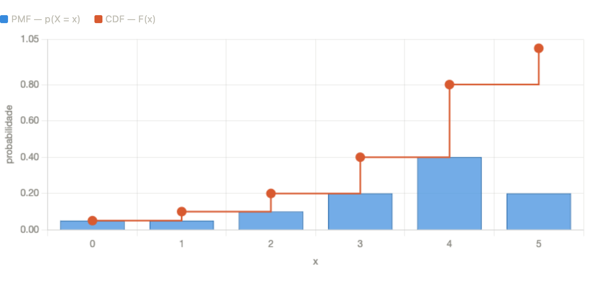
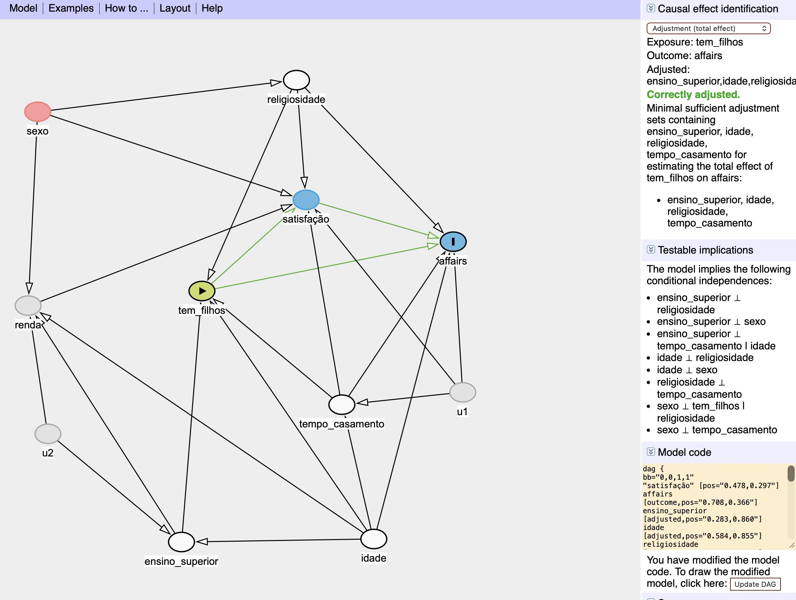

```{r}
#| include: false
source(here::here("_extensions/felipelmc/course-notes/r/notes.R"))
library(ggplot2)
```

::: {.callout-tip .achados}
## Principais resultados
- No experimento, o treinamento profissional aumentou a renda anual de 1978 em US$ 1.794, em média. Nos dados observacionais (CPS), a diferença ingênua de médias dá o sinal oposto: US$ -8.498.
- Pareamento por escore de propensão (US$ 1.672) e ponderação pelo inverso da probabilidade (US$ 1.718) chegam perto do gabarito experimental. A regressão com os pesos IPW, duplamente robusta, dá US$ 1.633; a regressão sozinha, US$ 1.349.
- No modelo de probabilidade linear para casos extraconjugais, ter filhos aumenta a probabilidade em 7,6 pontos percentuais, sem significância estatística, e o modelo prevê uma probabilidade negativa (-1,09) para um dos perfis, o que motiva o logit.
:::

```{r}
#| label: fig-att
#| fig-cap: "Estimativas do efeito do treinamento sobre a renda (ATT), por estimador, com os valores reportados nas questões 7.2 a 7.7. A linha tracejada marca o resultado experimental."
#| fig-width: 7
#| fig-height: 3.2
att <- data.frame(
  estimador = c("Experimento (gabarito)", "Diferença ingênua (CPS)", "Pareamento por escore",
                "Ponderação (IPW)", "Regressão (MQO)", "Regressão + IPW (duplamente robusto)"),
  valor = c(1794.34, -8497.52, 1672, 1718, 1348.96, 1633.22)
)
att$estimador <- factor(att$estimador, levels = rev(att$estimador))
grafico <- ggplot(att, aes(valor, estimador)) +
  geom_vline(xintercept = 1794.34, linetype = "dashed", colour = cn_palette$ink3) +
  geom_segment(aes(x = 0, xend = valor, yend = estimador), colour = cn_palette$line_strong) +
  geom_point(aes(colour = estimador == "Experimento (gabarito)"), size = 3.2, show.legend = FALSE) +
  scale_colour_manual(values = c(`TRUE` = cn_palette$award, `FALSE` = cn_palette$accent)) +
  scale_x_continuous(labels = scales::label_dollar(prefix = "US$ ", big.mark = ".", decimal.mark = ",")) +
  labs(x = "Efeito estimado sobre a renda anual de 1978", y = NULL) +
  theme_notes(base_size = 12)
grafico
```

```{r}
#| include: false
ggsave("destaque.png", grafico + theme(plot.margin = margin(18, 24, 18, 18)),
       width = 8, height = 4.5, dpi = 150, bg = "#F6F6F3")
```

::: {.callout-note collapse="true"}
## Uso de IA declarado na entrega
Usou algum site ou aplicativo de IA? (x) Sim () Não

Caso tenha usado, qual(is)?

Claude (Sonnet 4.6).

Caso tenha usado, qual foi o tipo de uso? Descreva detalhadamente.

Utilizei o modelo para tirar dúvidas e verificar raciocínios, como a distinção entre ATT e ATE, a lógica dos pesos IPW, e a propriedade de dupla robustez do estimador WLS com pesos IPW. Além disso, utilizei o modelo para revisar e consolidar conceitos básicos de probabilidade e estatística, sobretudo os conceitos de CDF e pmf. Em alguns casos, sob clara definição do que deveria ser feito, deleguei ao Claude a escrita dos códigos. Por exemplo, após especificar as variáveis e a estrutura desejada, solicitei que ele produzisse o código para construção das tabelas comparativas entre tratados e controles e para a criação do dataframe de novos dados utilizado na estimação de valores preditos nos modelos LPM e logit. Em outros casos, o código foi produzido por mim e o Claude ajudou na depuração e verificação dos resultados numéricos. Ao final, compartilhei o documento Word preenchido, o enunciado da lista e os dados disponibilizados para que o Claude conferisse se todas as perguntas haviam sido respondidas e se os valores numéricos estavam corretos.
:::

# 2. Pesquisa de aprovação do governo
## 2.1. Independência
( ) Sim (x) Não

**Justificativa:** Há independência quando Pr(Y \| X) = P(Y), isto é, a probabilidade condicional e a marginal coincidem. Sendo X a escolaridade e Y a aprovação de governo, podemos testar alguns casos. Em particular, calculamos que Pr(Y = Ótimo \| X = Ensino Fundamental) = 20/35, aproximadamente 57%. Mas a probabilidade marginal de avaliar o governo como "Ótimo" é de 35%. Logo, concluímos que não há independência entre escolaridade e avaliação do governo.

## 2.2 Probabilidade condicional à escolaridade
$\Pr\left( Avaliação = Ótimo|Escolaridade \leq Ensino\ Médio \right) =$ 40%.

**Justificativa:** A fórmula da probabilidade condicional divide a probabilidade da interseção de dois eventos pela probabilidade de ocorrência do evento condicionante. Matematicamente, P(A\|B) / P(B). Seja A a avaliação de governo e B a escolaridade. Conforme a tabela, a probabilidade de se avaliar o governo como "Ótimo" tendo até o Ensino Médio é de 30% (20% avaliam como Ótimo e tem Ensino Fundamental, e 10% avaliam como Ótimo e tem Ensino Médio). Já a probabilidade de se ter até o Ensino Médio é de 75% (35% com EF, 40% com EM). O resultado que queremos é a divisão das duas probabilidades: 30% / 75% = 40%.

## 2.3 Probabilidade condicional à aprovação
$\Pr\left( Escolaridade \leq Ensino\ Médio \middle| Avaliação = Ótimo \right) =$ 85,7%.

Justificativa: Esse resultado deriva precisamente da mesma fórmula da questão anterior, com a diferença de que invertemos A e B. A probabilidade de se avaliar o governo como "Ótimo" tendo até o Ensino Médio é a mesma, 30%. Mas o denominador muda, porque a condicionante é a aprovação, e a probabilidade marginal de se avaliar o governo como "Ótimo" é de 35%. Então: 30% / 35% = 85,7%.

## 2.4 Probabilidade marginal de ser branco
$\Pr(cor = Branco) =$ 48%.

**Justificativa:** Aqui, basta fazer uma espécie de ponderação das probabilidades. Se 35% da população tem Ensino Fundamental e 60% delas são brancas, então 21% (35% x 60%) são brancas. Se aplicarmos o mesmo raciocício para as demais categorias de escolaridade, teremos que dos 40% com EM, 22% (40% x 55%) são brancas; e dos 25% com Ensino Superior, 5% (25% x 20%) são brancas. Intuitivamente, a probabilidade marginal de ser branco é a soma dessas proporções: 21% + 22% + 5% = 48%.

## 2.5 Valor esperado e variância
$E(Aprova) =$ 65%

$Var(Aprova) =$ 22,75%

**Justificativa:** O valor esperado de uma variável binária é a proporção de ocorrências de "1"s, e a variância é p(1-p). Como a categoria "Aprovo" é a soma das marginais de "Ótimo" e "Regular", p = (35 + 30) / 100. Para a variância, basta substituir p na fórmula destacada.

# 3. Variáveis aleatórias discretas
## 3.1. Função de massa de probabilidade
$p(X = 2) =$ 0.1

**Justificativa:** Como a CDF acumula probabilidades, a probabilidade pontual em x é o incremento da CDF naquele ponto. Isto é, para obter o valor da função de massa de probabilidade (pmf) em X = 2, devemos tomar a diferença entre o valor da CDF avaliado em 2 e o valor da CDF avaliado em 1. Nesse caso, CDF(X = 2) -- CDF(X = 1) = 0.2 -- 0.1 = 0.1. O gráfico abaixo, gerado em uma seção de discussão com o Claude (Sonnet 4.6) a respeito dessa questão, ajuda a consolidar os conceitos.

{width="85%"}

## 3.2. Valor esperado e variância
$E(X) =$ 3.45

$Var(X) =$ 1.74

**Justificativa:** Por definição, o valor esperado é o somatório de todos os valores possíveis de X multiplicados pela sua probabilidade. Dada a CDF de X, podemos calcular os valores da PMF de X para cada ponto -- que nos dá justamente a probabilidade de cada observação x_i --, como já fizemos na questão anterior. Daí, basta calcular:

(0.05 x 0) + (0.05 x 1) + (0.1 x 2) + (0.2 x 3) + (0.4 x 4) + (0.2 x 5) = 3.45.

A variância, por sua vez, é dada por E\[X\^2\] -- (E\[X\])\^2. Para calcular o primeiro termo, basta repetir a fórmula do valor esperado, mas elevando ao quadrado cada x_i no somatório; o segundo valor é simplesmente o quadrado do valor esperado. Como resultado, teríamos algo como 13.65 -- 11.9 = 1.74.

# 4. Variáveis aleatórias contínuas
## 4.1. Valor esperado de variável uniforme
$E(X) =$ 7

Justificativa: Na variável uniforme, o valor esperado é o ponto médio do intervalo. De fato, esse resultado faz sentido na medida em que, nessa distribuição, a probabilidade de X = x_i é a mesma parada todo i. Também é possível obter a fórmula na Wikipedia, que nesse caso é E\[X\] = (a + b) / 2.

Em R, faríamos:

```{r}
#| eval: false
n = 10000
u = runif(n, min = 4, max=10)
mean(u)
```

## 4.2. Probabilidade acumulada de variável uniforme
$\Pr(X \leq 6) = F(X = 6) =$ 1/3

**Justificativa:** A maneira pela qual chegaríamos esse valor manualmente seria calculando uma integral. A probabilidade acumulada da uniforme, F(X = 6), seria a integral da função f(x) = 1 / (b-a), de 4 (o ponto mínimo) até 6. Essa tarefa é relativamente simples nesse caso, e fazendo isso chegaríamos a 1/3.

Em R, bastaria usar a função punif, que nos permite justamente avaliar a CDF de uma distribuição uniforme num ponto qualquer:

```{r}
#| eval: false
punif(6, min=4, max=10)
```

## 4.3. Probabilidade acumulada de variável normal
$\Pr(X > 38) =$ 0.02275013

**Justificativa:** O uso de funções como punif e pnorm nos permitem avaliar a CDF em um determinado ponto, isto é, toda a massa de probabilidade na região da distribuição que está abaixo do ponto avaliado. Matematicamente, Pr(X \<= x). Mas a questão nos pede Pr(X \> x), onde x é 38. Ou seja, precisamos do complementar da CDF, que é simplesmente 1-CDF(X = 38).

Intuitivamente, a CDF retorna toda a probabilidade acumulada até o ponto em particular. Então, para obter a probabilidade de se obter algo maior que o valor avaliado, basta obter o complementar.

Em R, faríamos:

```{r}
#| eval: false
1-pnorm(38, mean=34, sd=2)
```

## 4.4. Probabilidade acumulada de variável logística padrão
$\Pr(X \geq 3) = 1 - F(X = 3) = \ $ 0.04742587

**Justificativa:** A CDF de uma variável X com distribuição logística padrão é dada no enunciado. Como queremos $\Pr(X \geq 3)$, basta avaliar o valor da CDF em x = 3 e subtrair de 1. Em R, bastaria fazer:

```{r}
#| eval: false
1 - (1 / (1 + exp(-3)))
# ou ainda...
1 - plogis(3)
```

## 4.5. Função logit
$logit(0.99) = \ $ 4.59512

**Justificativa:** Os conceitos da questão são os seguintes: na questão anterior, tínhamos a fórmula da CDF, e a CDF nos dá a probabilidade acumulada de uma variável aleatória até um determinado ponto. Ou seja, ela recebe um valor e cospe uma probabilidade. A função logit, por outro lado, faz o contrário: ela recebe uma probabilidade, e retorna o valor de X abaixo do qual se acumula a probabilidade fornecida. Em R, faríamos:

```{r}
#| eval: false
qlogis(0.99)
# ou ainda...
log(0.99 / (1-0.99))
```

# 5. Causalidade
## 5.1. Comparação entre grupos
Não é razoável utilizar a diferença de médias como o estimador do ATT, conhecidamente um estimador enviesado no caso de estudos observacionais, como é o caso. A objeção mais direta à conclusão é a presença de um selection bias e a violação do princípio de exchangeability. Em outras palavras, não é razoável assumirmos que a atribuição do tratamento foi feita de forma aleatória, desconsiderando o potencial resultado futuro de cada indivíduo na amostra.

Do ponto de vista dos DAGs, o problema pode ser formalizado como a presença de backdoors não bloqueados entre D e o outcome. Certamente há covariáveis que afetam tanto a probabilidade de condenação quanto a mortalidade, o que gera uma associação espúria entre o tratamento e o outcome caso não sejam implementadas estratégias adequadas de identificação.

## 5.2. Conceitos
a.  **Resultados potenciais**

Suponha um tratamento binário D. Há dois resultados possíveis para um indivíduo i: Y(1) é o resultado potencial desse indivíduo quando ele recebe o tratamento, e Y(0) é o resultado potencial desse mesmo indivíduo quando ele não recebe o tratamento. O problema fundamental é que, para um mesmo indivíduo, só observamos o resultado Y(1) ou Y(0), nunca os dois simultaneamente. Por isso, para estimar efeitos causais, implementamos experimentos ou, mais frequentemente, utilizamos outras estratégias de identificação com dados observacionais.

b.  **Estimandos**

O estimando é a quantidade a ser estimada, isto é, a pergunta causal propriamente dita. O valor do estimando é uma estimativa, obtida utilizando algum estimador. Quando queremos estimar o efeito de D sobre Y, esse efeito causal (o ATE, por exemplo) é o estimando, o valor obtido para o ATE é a estimativa e a fórmula do ATE é o estimador.

c.  **Independência ou ignorabilidade perfeita**

Trata-se do caso de experimentos totalmente aleatórios, quando o tratamento foi atribuído sem considerar a expectativa de resultados futuros de cada indivíduo. Isto é, os resultados ( Y(1), Y(0) ) ⊥ D sem condicionar a qualquer variável X.

d.  **Independência condicional ou ignorabilidade estrita**

Independência condicional é a ideia de que, se eu observo todas as variáveis X relevantes e controlo por todas elas, então dentro das combinações dessas variáveis passa a valer a matemática de um experimento totalmente aleatório. Formalmente, ( Y(1), Y(0) ) ⊥ D \| X.

e.  **Seleção em não observáveis**

A seleção em não observáveis ocorre quando há um confundidor não registrado nos dados, isto é, uma variável que afeta simultaneamente a atribuição ao tratamento e o desfecho, mas que sequer existe no banco de dados. Como não é possível controlar por ela, a independência condicional não pode ser satisfeita por nenhum conjunto de covariáveis observadas.

# 6. Casos extraconjugais
## 6.1. *Back doors*
Como se tratava de um DAG relativamente complexo de ser analisado manualmente, reproduzi o grafo no dagitty.net para facilitar o processo. Segundo esse DAG, a estimação do efeito causal de tem_filhos sobre affairs é possível, dado que sejam incluídas as seguintes variáveis como controle: ensino_superior, idade, religiosidade e tempo_casamento.

{width="85%"}

## 6.2. Implicações testáveis do DAG
O DAG proposto prevê independência marginal entre sexo e tempo de casamento. Se calculamos a correlação entre as variáveis, obtemos valor bem próximo de zero, e, portanto, o valor é consistente com a predição.

## 6.3. Estimando o modelo de probabilidade linear (LPM)
*Somente no R (ver o código no fim da página).*

## 6.4. Interpretação de coeficientes do LPM
O coeficiente estimado para tem_filhos é de 0.076. Em termos substantivos, isso significa que ter filhos aumenta em 7.6 pontos percentuais a chance de se ter um caso extraconjugal -- de fato, corroborando a hipótese. No entanto, a estimativa não pode ser estatisticamente distinguida de zero, isto é, não parece haver efeito.

## 6.5. Cálculo de valores preditos no LPM
No caso do perfil sugerido, estimamos uma probabilidade negativa de o indivíduo ter um caso extraconjugal. Mais especificamente, a probabilidade predita nesse caso é de -1.09. Naturalmente, probabilidades devem estar limitadas ao intervalo \[0, 1\] e, portanto, esse resultado não é razoável.

## 6.6. Estimando o modelo logit
*Somente no R (ver o código no fim da página).*

## 6.7. Interpretação de coeficientes do modelo logit
Do ponto de vista substantivo, o resultado é mais ou menos semelhante ao do LPM. Em particular, observamos que ter filhos está associado a um aumento de 0.5 na log-odds de se ter um affair, o que corrobora a hipótese de trabalho. E, nesse caso, o coeficiente não é estatisticamente significativo ao nível de 5% (mas é quase, se quisermos ser pouco menos rigorosos).

## 6.8. Cálculo de valores preditos no logit
Aplicando a função plogis() ao valor predito do modelo logit, obtemos o valor da CDF da distribuição logística até o ponto predito. O valor predito nesse caso é de -9.66, e substituindo na CDF via plogis(), obtemos 0.00006371983. Em outras palavras, a probabilidade de um indivíduo com esse perfil se envolver em um caso extraconjugal é praticamente zero, dado o modelo ajustado.

# 7. Seleção em observáveis
## 7.1. Análise descritiva
O grupo de controle e o grupo tratado são muito mais parecidos no caso experimental. Basta observar que, nesse caso, as médias nas variáveis analisadas são bem próximas nos dois grupos -- algo que não se observa no caso observacional. Faz sentido comparar os grupos olhando para características pré-tratamento porque, na prática, gostaríamos que os grupos fossem comparáveis antes da intervenção ser realizada, permitindo estimar o efeito causal da intervenção.

No caso observacional, o perfil do grupo controle e de tratamento é sistematicamente diferente em todas as variáveis fixas observadas. Na prática, sem algum tipo de estratégia de identificação como o matching, seria impossível estimar o efeito causal da intervenção sem que a estimativa estivesse, em larga medida, contaminada pelas diferenças entre os perfis amostrais de cada grupo.

## 7.2. ATT no experimento
$ATT_{experimento} =$ 1794.342

**Justificativa:** conforme o próprio enunciado especifica, como os dados são experimentais, o ATT pode ser obtido simplesmente calculando a diferença de médias entre tratados e controles. Isso, é claro, assumindo que o experimento foi bem conduzido. Fazendo isso, portanto, obtemos uma diferença de 1.794.34. Em termos substantivos, isso significa que o treinamento profissional aumentou, em média, a renda anual dos participantes em US\$ 1.794,34 no ano de 1978.

## 7.3. ATT ingênuo nos dados não experimentais
$ATT_{ingenuo} =$ -8497.516

**Justificativa:** a estimativa ingênua diz que o efeito do treinamento profissional reduziu a renda dos tratados. Como comentado em oportunidades anteriores, sabemos a diferença de médias para dados observacionais é uma estimativa ingênua justamente porque é contaminada pelas diferenças entre os grupos antes do tratamento. Sem a estratégia adequada para controlar essas diferenças, a estimativa não nos diz nada em termos substantivos.

## 7.4. Estimação do propensity score
O propensity score mede a probabilidade de o indivíduo pertencer ao grupo tratado dadas as suas covariáveis. No caso dos dados observacionais analisados, o propensity score médio para o grupo tratado é de 0.415, enquanto para o grupo não tratado é de 0.0067. Em outras palavras, o modelo é capaz de prever com relativa precisão se o indivíduo está no grupo de tratamento ou controle dadas as covariáveis, o que fere, no mínimo, o pressuposto de ignorabilidade.

## 7.5. Propensity score matching com vizinho mais próximo
O pareamento melhorou o equilíbrio das covariáveis, e podemos ver isso a partir do summary(M). Veja, por exemplo, a idade, cuja média era de 25.8 anos no grupo tratado e 33.2 no grupo controle antes do pareamento. Após o pareamento, a média das idades nos grupos é praticamente idêntica. O mesmo vale para o nível educacional e uma série de outras covariáveis. O propensity score médio também melhorou significativamente, e agora o propensity score dos controles pareados possuem uma probabilidade de tratamento relativamente parecida com a dos tratados (antes, a probabilidade era praticamente zero, e agora é em torno de 0.30). No que diz respeito à estimativa do ATT, o viés em relação à estimativa ingênua também foi reduzido drasticamente. Se antes o ATT calculado era de -8497.516, agora ele é 1672 -- valor, aliás, muito semelhante ao calculado no contexto experimental (1794.342).

## 7.6. Inverse probability weighting
Usando o ipw, chegamos a um resultado ainda mais semelhante ao do desenho experimental. Nesse caso, o ATT obtido foi de 1.718, bem próximo do 1794.342. Trata-se de uma estimativa melhor do que a obtida via matching, e muito melhor do que a obtida via estimativa ingênua.

## 7.7. Regressão
A ideia de utilizar a regressão junto dos pesos obtidos via matching (e inverse probability weighting) é que o matching melhora o desenho, e a regressão ajusta o que restou. Na prática, juntas, essas abordagens ajudam a produzir inferências mais robustas e menos dependentes do modelo.

De fato, os resultados obtidos nessa questão confirmam isso: quando ajustamos um modelo OLS multivariado incluindo as variáveis da regressão logística ajustada anteriormente, estimamos um ATT de 1348.96. Não é o resultado ideal, dado o "gabarito" experimental, mas é bem melhor do que o resultado obtido via estimativa ingênua, que não implementa nenhuma estratégia de identificação. Mas quando combinamos a regressão com os pesos IPW obtidos antes, o ATT estimado se torna 1633.22, valor bem mais próximo do gabarito. No segundo caso, o estimador é "duplamente robusto", para usar uma nomenclatura da literatura de inferência causal.

# Código

O script entregue, com as respostas das questões feitas só no R. Os arquivos de dados (`affairs.csv`, `lalonde_experimento.csv` e `lalonde_cps.csv`) estão na mesma pasta.

```{r}
#| eval: false
#| code-fold: true
#| code-summary: "FelipeLamarca-lego3-lista01.R"
#| file: FelipeLamarca-lego3-lista01.R
```
